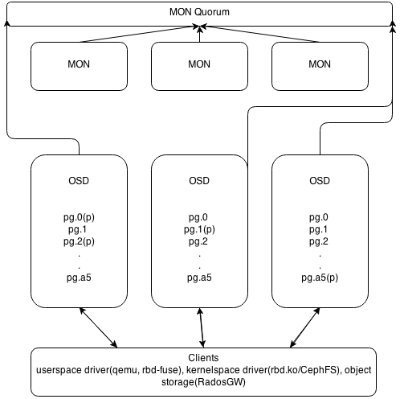

# Ceph

Взято [отсюда](https://habrahabr.ru/company/performix/blog/21806ю).

## Терминология 

Ниже перечислены основные сущности Ceph.

`Metadata server (MDS)` — вспомогательный демон для обеспечения синхронного состояния файлов в точках монтирования CephFS. Работает по схеме активная копия + резервы, причем активная копия в пределах кластера только одна.

`Mon (Monitor)` — элемент инфраструктуры Ceph, который обеспечивает адресацию данных внутри кластера и хранит информацию о топологии, состоянии и распределении данных внутри хранилища. Клиент, желающий обратиться к блочному устройству rbd или к файлу на примонтированной cephfs, получает от монитора имя и положение rbd header — специального объекта, описывающего положение прочих объектов, относящихся к запрошенной абстракции (блочное устройство или файл) и далее общается со всеми OSD, участвующими в хранении файла.

`Объект (Object)` — блок данных фиксированного размера (по умолчанию 4 Мб). Вся информация, хранимая в Ceph, квантуется такими блоками. Чтобы избежать путаницы подчеркнем — это не пользовательские объекты из Object Storage, а объекты, используемые для внутреннего представления данных в Ceph.

`OSD (object storage daemon)` — сущность, которая отвечает за хранение данных, основной строительный элемент кластера Ceph. На одном физическом сервере может размещаться несколько OSD, каждая из которых имеет под собой отдельное физическое хранилище данных.

`Карта OSD (OSD Map)` — карта, ассоциирующая каждой плейсмент-группе набор из одной Primary OSD и одной или нескольких Replica OSD. Распределение placement groups (PG) по нодам хранилища OSD описывается срезом карты osdmap, в которой указаны положения всех PG и их реплик. Каждое изменение расположения PG в кластере сопровождается выпуском новой карты OSD, которая распространяется среди всех участников.

`Плейсмент-группа (Placement Group, PG)` — логическая группа, объединяющая множество объектов, предназначенная для упрощения адресации и синхронизации объектов. Каждый объект состоит лишь в одной плейсмент группе. Количество объектов, участвующих в плейсмент-группе, не регламентировано и может меняться.

`Primary OSD` — OSD, выбранная в качестве Primary для данной плейсмент-группы. Клиентское IO всегда обслуживается той OSD, которая является Primary для плейсмент группы, в которой находится интересующий клиента блок данных (объект). Primary OSD в асинхронном режиме реплицирует все данные на Replica OSD.

`RADOS Gateway (RGW)` — вспомогательный демон, исполняющий роль прокси для поддерживаемых API объектных хранилищ. Поддерживает географически разнесенные инсталляции (для разных пулов, или, в представлении Swift, регионов) и режим active-backup в пределах одного пула.

`Replica OSD (Secondary)` — OSD, которая не является Primary для данной плейсмент-группы и используется для репликации. Клиент никогда не общается с ними напрямую.

`Фактор репликации (RF)` — избыточность хранения данных. Фактор репликации является целым числом и показывает, сколько копий одного и того же объекта хранит кластер.

## Архитектура

Основных типов демонов в Ceph два — мониторы (MON) и storage-ноды (OSD). RGW и MDS демоны не участвуют в распределении данных, являясь вспомогательными сервисами. Мониторы объединяются в кворум и общаются по PAXOS-подобному протоколу. Собственно, кластер является работоспособным до тех пор, пока в нем сохраняется большинство участников сконфигурированного кворума, то есть при ситуации split-brain посередине и четном количестве участников «выживет» только одна часть, поскольку предыдущие выборы в PAXOS автоматически уменьшили число активных участников до нечетного числа. При потере большинства кворума кластер «замораживается» для любых операций, предотвращая возможное рассогласование записанных или прочитанных данных до восстановления минимального кворума.

## Восстановление и перебалансировка данных

Потеря из вида одной из копий объекта приводит к переходу объекта и содержащей его плейсмент-группы в состояние degraded и выпуску новой карты OSD (osdmap). Новая карта содержит новое расположение потерянной копии объекта и, если через заданное время утраченная копия не вернется, недостающая копия будет восстановлена в другом месте, чтобы сохранить число копий, определяемое фактором репликации. Операции, выполнявшиеся в момент подобной ошибки, автоматически переключатся на одну из доступных копий. В худшем случае их задержка будет измеряться единицами секунд.

Важным свойством Ceph является то, что все операции по перебалансировке кластера происходят в фоновом режиме одновременно с пользовательским I/O. Если клиент обращается к объекту, который находится в recovering состоянии, Ceph вне очереди восстановит объект и его копии, а затем выполнит запрос клиента. Такой подход обеспечивает минимальное латенси I/O даже тогда, когда восстановление кластера идет полным ходом.

## Распределение данных в кластере

Одна из самых важных особенностей Ceph — возможность тонкой настройки репликации, задаваемой правилами CRUSH — мощного и гибкого механизма, базирующегося на случайном распределении PG по группе OSD с учетом правил (вес, состояние ноды, запрет на размещение в той же группе нод). По умолчанию OSD имеют вес, базирующийся на величине свободного места в соответствующей точке монтирования в момент ввода OSD в кластер и подчиняются правилу распределения данных, запрещающему держать две копии одной PG на одной ноде. CRUSHMAP — описание распределения данных — может быть модифицирован под правила, запрещающие держать вторую копию в пределах одной стойки, тем самым обеспечивая отказоустойчивость на уровне вылета целой стойки.

Теоретически, подобный подход позволяет осуществлять в том числе гео-репликацию в реальном времени, однако на практике это можно использовать лишь в режиме Object Storage, поскольку в режимах CephFS и RBD задержки операций будут слишком велики.

## Альтернативы и преимущества Ceph

Наиболее качественной и близкой по духу свободной кластерной ФС являются GlusterFS. Она поддерживается RedHat и имеет некоторые преимущества (например, локализует Primary копию данных рядом с клиентом). Однако наши тесты показали некоторое отставание GlusterFS в смысле производительности и плохую отзывчивость при перестроении. Другие серьезные минусы — отсутствие CoW (в том числе и в прогнозируемом будущем) и низкая активность сообщества.

Преимущество Ceph перед прочими кластерными системами хранения данных состоит в отсутствии единых точек отказа и в практически нулевой стоимости обслуживания при восстановительных операциях. Избыточность и устойчивость к авариям заложена на уровне дизайна и достается даром.

Возможные замены подразделяются на два типа — кластерные фс для суперкомпьютеров(GPFS/Lustre/etc.) и дешевые централизованные решения вроде iSCSI или NFS. Первый тип достаточно сложен в обслуживании и не заточен на эксплуатацию в условиях отказавшего оборудования — «замораживание» ввода-вывода, особенно чувствительное при экспорте точки монтирования в вычислительную ноду, не позволяет использовать подобные фс в публичном сегменте. Минусы «классических» решений довольно хорошо понятны — отсутствие масштабируемости и необходимость закладывать топологию для failover на уровне железа, что приводит к увеличению стоимости.

С Ceph восстановление и перестроение кластера происходят действительно незаметно, практически не влияя на клиентское I/O. То есть деградировавший кластер для Ceph — это не экстраординарная ситуация, а всего лишь одно из рабочих состояний. Насколько нам известно, ни одна другая открытая программная СХД не имеет этого свойства, достаточного для ее использования в публичном облаке, где запланированное прекращение обслуживания невозможно.

## Производительность

Как указывалось в начале статьи, данные в Ceph квантуются достаточно маленькими порциями и псевдослучайно распределены по OSD. Это приводит к тому, что реальное I/O каждого клиента Ceph достаточно равномерно «размазывается» по всем дискам кластера. В результате этого:

* Снижается накал борьбы между клиентами за дисковый ресурс

* Растет верхняя планка теоретически возможной интенсивности работы с блочным устройством

* Вследствие п.1 и 2 каждый клиент получает существенно большие удельные лимиты по iops и bandwidth, чем может дать классический подход за те же деньги

Есть и другие причины быстродействия Ceph. Все операции записи сначала попадают в журнал OSD, а затем, не задерживая клиента, асинхронно переносятся в персистентное файловое хранилище. Поэтому размещение журнала на SSD, которое рекомендовано в документации Ceph, многократно ускоряет операции записи.

